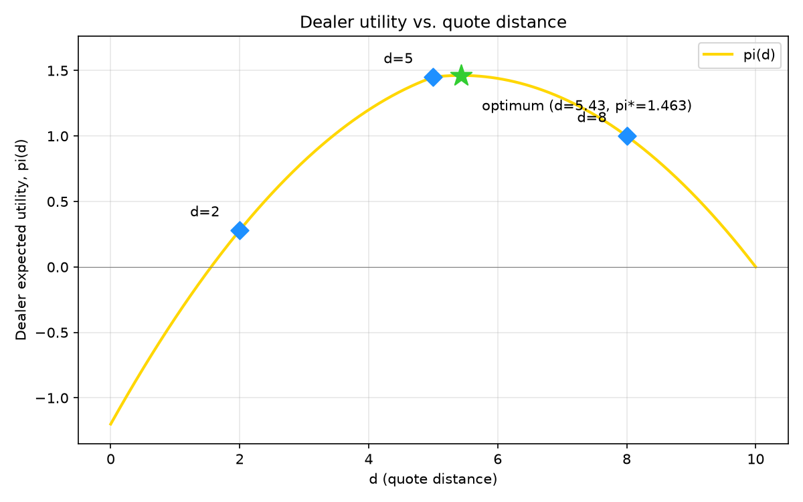

# Act03 — Modelo de Copeland-Galai

Implementacion del modelo de market maker de Copeland-Galai (1983).
Calcula la ganancia esperada del dealer para spreads simetricos
(d = A - S0 = S0 - B) y encuentra la distancia optima de cotizacion.

## Parametros
- S0 = 100, alpha = 0.5, beta = 0.05
- pi_I = 0.30 (trader informado), pi_L = 0.70 (trader de liquidez)
- f(P) sobre {90, 95, 100, 105, 110} con probabilidades {0.10, 0.20, 0.40, 0.20, 0.10}

## Resultados

| d | A   | B  | G(A,B) | L(A,B) | pi(A,B) |
|---|-----|----|--------|--------|---------|
| 2 | 102 | 98 | 1.1200 | 0.8400 | 0.2800  |
| 5 | 105 | 95 | 1.7500 | 0.3000 | 1.4500  |
| 8 | 108 | 92 | 1.1200 | 0.1200 | 1.0000  |

Distancia optima de cotizacion: **d\* = 5.43**, con **pi\* = 1.463**

## Grafica


## Como correrlo
```bash
python3 -m venv venv
source venv/bin/activate
pip install -r requirements.txt
python3 copeland_galai.py
```
